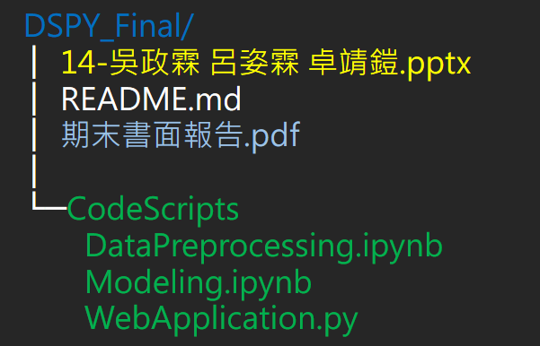

# 14 - 以人臉五官預測性取向

成員：吳政霖、卓靖鎧、呂姿霖

# 小組期末專案

## 繳交項目

- [ ] Data

  - 由於圖片資料的取得有隱私考量，所以不附於公開 repo 中

- [ ] CodeScripts

  - Data Preprocessing： [`DataPreprocessing.ipynb`](https://github.com/WuRobber/DSPY_Final/blob/main/CodeScripts/DataPreprocessing.ipynb)
  - Modeling： [`Modeling.ipynb`](https://github.com/WuRobber/DSPY_Final/blob/main/CodeScripts/Modeling.ipynb)
  - Web Application： [`WebApplication.py`](https://github.com/WuRobber/DSPY_Final/blob/main/CodeScripts/WebApplication.py)

- [ ] 書面報告

  - 檔名：[`期末書面報告`](https://github.com/WuRobber/DSPY_Final/blob/main/%E6%9C%9F%E6%9C%AB%E6%9B%B8%E9%9D%A2%E5%A0%B1%E5%91%8A.pdf)

- [ ] PPT
  - 檔名：[`14-吳政霖 呂姿霖 卓靖鎧.ppt`](https://github.com/WuRobber/DSPY_Final/blob/main/14-%E5%90%B3%E6%94%BF%E9%9C%96%20%E5%91%82%E5%A7%BF%E9%9C%96%20%E5%8D%93%E9%9D%96%E9%8E%A7.pptx)

## Folder Tree

## ==！！ 買就對了 ！！== ( 點擊下方圖片 )

